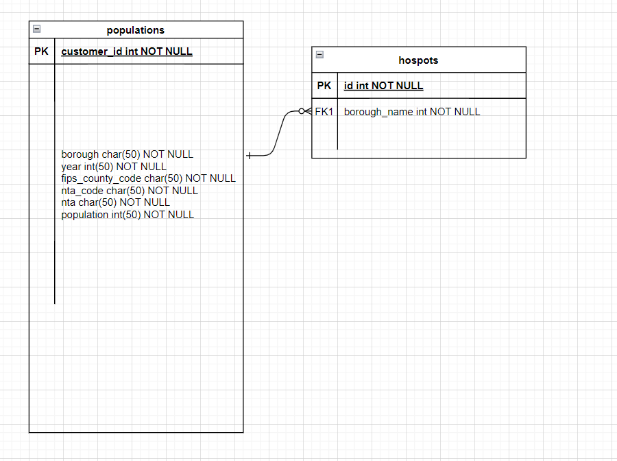

# Exam 1

Update the solution contents of this file according to [the instructions](instructions/instructions.md).

## Solutions

The following sections contain a report on the solutions to each of the required components of this exam.

### Data munging

The code in the Python program, [solution.py](solution.py), contains the solutions to the **data munging** part of this exam.

### Spreadsheet analysis

The spreadsheet file, [wifi.xslx](data/wifi.xslx), contains the solutions to the **spreadsheet analysis** part of this exam. In addition, the formulas used in that spreadsheet are indicated below:

1. Total number of free Wi-Fi hotspots in NYC

```
2736
COUNTIF(C3:C3321,"Free")
```

2. Number of free Wi-Fi hotspots in each of the 5 boroughs of NYC.

```
COUNTIFS(C3:C3321,"Free",R3:R3321,"Manhattan")
1573
COUNTIFS(C3:C3321,"Free",R3:R3321,"Brooklyn")
540
COUNTIFS(C3:C3321,"Free",R3:R3321,"Queens")
379
COUNTIFS(C3:C3321,"Free",R3:R3321,"Bronx")
196
COUNTIFS(C3:C3321,"Free",R3:R3321,"Staten Island")
48
```

3. Number of free Wi-Fi hotspots provided by the LinkNYC - Citybridge in each of the zip codes of Manhattan.

```
COUNTIFS($C$3:$C$3321,"Free",$D$3:$D$3321,"LinkNYC - Citybridge",$V$3:$V$3321,"10001")
```

4. The percent of all hotspots in Manhattan that are provided by LinkNYC - Citybridge.

```
(SUM(AF14:AF60)/AF9)*100
```

### SQL queries

This section shows the SQL queries that you determined solved each of the given problems.

1. Write two SQL commands to create two tables named `hotspots` and `populations`.

```sql
create_query = 'CREATE TABLE '+'hotspots' +' ("id1" INT,"id" INT,"borough_id" INT,"type" TEXT,"provider" TEXT,"name" TEXT,"location" TEXT,"latitude" DOUBLE,"longitude" DOUBLE,"x" DOUBLE,"y" DOUBLE,"location_t" TEXT,"remarks" TEXT,"city" TEXT,"ssid" TEXT,"source_id" INT,"activated" TEXT,"borough_name" TEXT,"nta_code" TEXT,"nta" TEXT,"postcode" INT)'
```

```sql
create_query = 'CREATE TABLE '+'populations' +' ("borough" TEXT,"year" INT,"fips_county_code" INT,"nta_code" TEXT,"nta" TEXT,"population" INT)'
```

2. Import the data in the `wifi.csv` and `neighborhood_populations.csv` CSV files into these two tables.

```sql
reader = csv.DictReader(open(csvpath,encoding='utf-8'),delimiter=',',quoting=csv.QUOTE_MINIMAL)
conn = sqlite3.connect(dbpath)
# shz: fix error with non-ASCII input
conn.text_factory = str
c = conn.cursor()
c.execute("drop table {}".format(tablename))
create_query = 'CREATE TABLE '+tablename +' ("id1" INT,"id" INT,"borough_id" INT,"type" TEXT,"provider" TEXT,"name" TEXT,"location" TEXT,"latitude" DOUBLE,"longitude" DOUBLE,"x" DOUBLE,"y" DOUBLE,"location_t" TEXT,"remarks" TEXT,"city" TEXT,"ssid" TEXT,"source_id" INT,"activated" TEXT,"borough_name" TEXT,"nta_code" TEXT,"nta" TEXT,"postcode" INT)' 
c.execute(create_query)
for row in reader:
    to_db = [row[''], row['id'],row['borough_id'],row['type'],row['provider'],row['name'],row['location'],row['latitude'],row['longitude'],row['x'],row['y'],row['location_t'],row['remarks'],row['city'],row['ssid'],row['source_id'],row['activated'],row['borough_name'],row['nta_code'],row['nta'],row['postcode']]
    c.execute('INSERT INTO '+tablename+' (id1, id,borough_id,type,provider,name,location,latitude,longitude,x,y,location_t,remarks,city,ssid,source_id,activated,borough_name,nta_code,nta,postcode) VALUES (?, ?, ?,?, ?, ?,?, ?, ?,?,?,?,?,?,?,?,?,?,?,?,?);', to_db)
conn.commit()
```

```sql
reader = csv.DictReader(open(csvpath,encoding='utf-8'),delimiter=',',quoting=csv.QUOTE_MINIMAL)
conn = sqlite3.connect(dbpath)
# shz: fix error with non-ASCII input
conn.text_factory = str
c = conn.cursor()
c.execute("drop table {}".format(tablename))
create_query = 'CREATE TABLE '+tablename +' ("borough" TEXT,"year" INT,"fips_county_code" INT,"nta_code" TEXT,"nta" TEXT,"population" INT)' 
c.execute(create_query)
for row in reader:
    to_db = [row['borough'], row['year'],row['fips_county_code'],row['nta_code'],row['nta'],row['population']]
    c.execute('INSERT INTO '+tablename+' (borough, year,fips_county_code,nta_code,nta,population) VALUES (?, ?, ?,?, ?, ?);', to_db)
conn.commit()

```

3. Display the five zip codes with the most Wi-Fi hotspots and the number of Wi-Fi-hotspots in each in descending order of the number of Wi-Fi-hotspots.

```sql
sql="SELECT postcode,count(*) FROM  hotspots GROUP BY postcode ORDER BY count(*) desc"
```

4. Display a list of the name, location, and zip code for all of the free Wi-Fi locations provided by `ALTICEUSA` in Bronx, in descending order of zip code.

```sql
sql="SELECT name,location,postcode FROM  hotspots where provider='ALTICEUSA' and borough_name="Bronx" ORDER BY postcode desc"
```

5. Display the names of each of the boroughs of NYC, and the number of free Wi-Fi hotspots in each.

```sql
sql="SELECT name,count(name) FROM  hotspots where borough_name='Manhattan'"
sql="SELECT name,count(name) FROM  hotspots where borough_name='Brooklyn'"
sql="SELECT name,count(name) FROM  hotspots where borough_name='Queens'"
sql="SELECT name,count(name) FROM  hotspots where borough_name='Bronx'"
sql="SELECT name,count(name) FROM  hotspots where borough_name='Staten Island'"
```

6. Display the number of wifi hotspots in Bay Ridge, Brooklyn along with the population of Bay Ridge, Brooklyn.

```sql
sql="SELECT count(*) FROM  hotspots where nta like '%Bay Ridge%'"
sql="SELECT sum(population)  FROM  populations where nta like '%Bay Ridge%'"
sql="SELECT count(*) FROM  hotspots where nta like '%Brooklyn%'"
sql="SELECT sum(population)  FROM  populations where nta like '%Brooklyn%'"
```

7. Display the number of **Free** wifi hotspots in each of the 5 NYC boroughs, along with the population of each borough.

```sql
sql="SELECT name FROM  hotspots where borough_name='Manhattan' and type='Free'"
sql="SELECT name FROM  hotspots where borough_name='Brooklyn' and type='Free'"
sql="SELECT name FROM  hotspots where borough_name='Queens' and type='Free'"
sql="SELECT name FROM  hotspots where borough_name='Bronx' and type='Free'"
sql="SELECT name FROM  hotspots where borough_name='Staten Island' and type='Free'"

sql="SELECT sum(population)  FROM  populations where borough='Manhattan'"
sql="SELECT sum(population)  FROM  populations where borough='Brooklyn'"
sql="SELECT sum(population)  FROM  populations where borough='Queens'"
sql="SELECT sum(population)  FROM  populations where borough='Bronx'"
sql="SELECT sum(population)  FROM  populations where borough='Staten Island'"
```

8. Display the names of each of the neighborhoods in which there exist Wi-Fi hotspots, but for which we do not have population data.

```sql
sql="SELECT nta FROM  hotspots where nta not in (select nta from populations) and type=''"
```

9. Write an additional SQL query of your choice using MySQL with this table; then describe the results

Write a description of the query here.

```sql
sql="SELECT name,location  FROM  hotspots where postcode=11215"
```

### Normalization and Entity-relationship diagramming

This section contains responses to the questions on normalization and entity-relationship diagramming.

1. Is the data in `wifi.csv` in fourth normal form?

```
no
```

2. Explain why or why not the `wifi.csv` data meets 4NF.

```
nta and nta_code have delivery dependency, latitude and longitude is facts about location instead of hotspot, thus, there is data redundancy, and thus it does not meet 3nf. 
```

3. Is the data in `neighborhood_populations.csv` in fourth normal form?

```
no
```

4. Explain why or why not the `neighborhood_populations.csv` data meets 4NF.

```
It does not meet the requirements of 3NF. nta and nta code have delivery dependency, nta_code reflect information about only the nta but not the entity, could be split into two tables.
```

5. Use [draw.io](https://draw.io) to draw an Entity-Relationship Diagram showing a 4NF-compliant form of this data, including primary key field(s), relationship(s), and cardinality.




